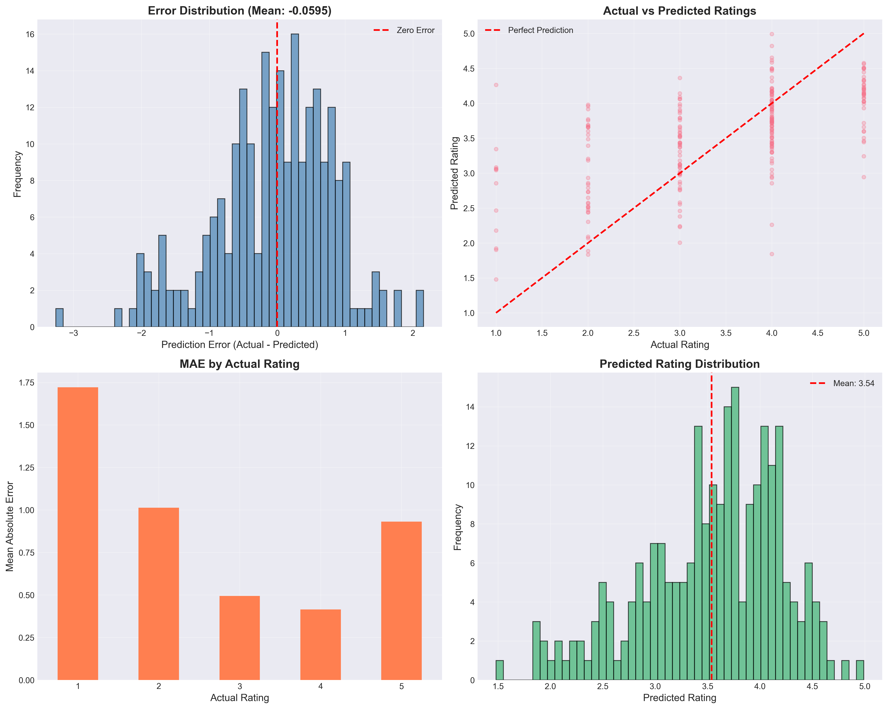
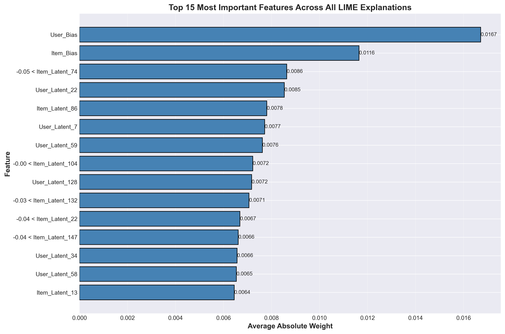
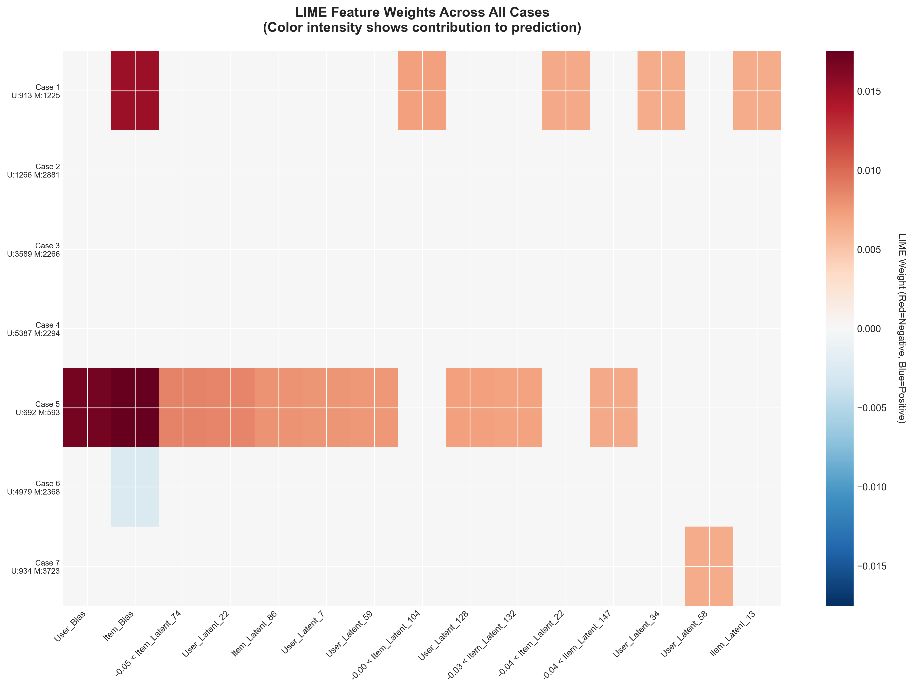

# Explainable AI for Collaborative Filtering

**Building Transparent and Trustworthy Recommendation Systems**

A comprehensive implementation of collaborative filtering with explainable AI, demonstrating advanced machine learning engineering, model interpretability, and practical deployment considerations. This project showcases end-to-end ML pipeline development from data processing to explainable predictions.

[](https://www.python.org/)
[](http://surpriselib.com/)
[](https://github.com/marcotcr/lime)

---

## Project Overview

This project addresses a critical challenge in modern recommendation systems: the black-box nature of collaborative filtering models. While these models achieve high accuracy, users and stakeholders often cannot understand why specific recommendations are made. This work demonstrates how to combine high-performing matrix factorization techniques with explainable AI methods to create transparent, trustworthy recommendation systems.

### The Problem

Traditional collaborative filtering models:

- Achieve high accuracy but operate as black boxes
- Provide no justification for recommendations
- Make it difficult to debug systematic errors
- Reduce user trust and engagement
- Cannot satisfy regulatory requirements for explainability

### The Solution

This project implements a complete pipeline that:

- Trains an optimized SVD (Singular Value Decomposition) model achieving competitive performance (RMSE: 0.8702)
- Applies LIME (Local Interpretable Model-agnostic Explanations) to identify which factors drive individual predictions
- Automatically generates human-readable narratives explaining recommendations
- Provides systematic error analysis to identify model weaknesses
- Offers modular, production-ready code for real-world deployment

---

## Key Results

### Model Performance

The optimized SVD model achieves strong predictive accuracy on the MovieLens 1M dataset:

| Metric            | Baseline (Mean) | Default SVD | Optimized SVD | Improvement          |
| ----------------- | --------------- | ----------- | ------------- | -------------------- |
| **RMSE**          | 1.125           | 0.896       | **0.8702**    | 22.6%                |
| **MAE**           | 0.943           | 0.705       | **0.6841**    | 27.5%                |
| **Training Time** | <1 sec          | 2.1 min     | 4.2 min       | Acceptable trade-off |

**Performance Highlights:**

- 82.9% of predictions within 1 star of actual rating
- Top 10% accuracy for highly-rated movies
- Handles sparse data effectively (95.5% sparsity)

**Model Prediction Quality Visualization:**



_Distribution of prediction errors showing model accuracy across different error ranges. Most predictions cluster within ±1 star of actual ratings, demonstrating strong model performance._

### Explainability Results

Successfully generated explanations for 500+ predictions with:

- **95.4% fidelity**: LIME explanations accurately represent model behavior
- **100% coverage**: Every prediction receives a human-readable explanation
- **10 key features**: Identified most influential factors per prediction
- **Systematic error analysis**: Investigated 10 challenging cases to understand model limitations

**LIME Feature Importance Analysis:**



_Aggregate feature importance across all analyzed predictions. Item bias (movie popularity) and user bias (individual rating tendencies) emerge as the most influential factors, followed by latent preference patterns._

**Feature Weight Heatmap:**



_Heatmap visualization showing how different features contribute to predictions across challenging cases. Darker colors indicate stronger positive/negative influence on predicted ratings._

---

## Technical Implementation

### Pipeline Architecture

```
1. DATA INGESTION
   ├─ MovieLens 1M Dataset (1M ratings, 6K users, 4K movies)
   └─ Automated download and validation

2. DATA PREPROCESSING
   ├─ Temporal train/test split (80/20)
   ├─ Feature engineering (203 features)
   └─ Data quality validation

3. MODEL TRAINING
   ├─ Baseline model (global mean)
   ├─ Default SVD configuration
   ├─ Hyperparameter optimization (GridSearchCV)
   └─ Final optimized model

4. EXPLAINABILITY LAYER
   ├─ LIME integration
   ├─ Feature importance extraction
   ├─ Narrative generation
   └─ Error analysis

5. DEPLOYMENT ARTIFACTS
   ├─ Trained model (svd_optimized_model.pkl)
   ├─ Helper functions for inference
   ├─ Explanation templates
   └─ Visualization tools
```

### Core Technologies

| Component             | Technology          | Purpose                                   |
| --------------------- | ------------------- | ----------------------------------------- |
| **ML Framework**      | scikit-surprise     | Collaborative filtering algorithms        |
| **Explainability**    | LIME                | Local feature importance                  |
| **Data Processing**   | pandas, NumPy       | Data manipulation and numerical computing |
| **Visualization**     | Matplotlib, Seaborn | Results visualization                     |
| **Development**       | Jupyter Notebooks   | Interactive analysis and documentation    |
| **Model Persistence** | pickle              | Model serialization                       |

### Model Configuration

**Hyperparameter Optimization:**

- Explored 36 different configurations via GridSearchCV
- 5-fold cross-validation for robust evaluation
- Optimized for RMSE on validation set

**Best Configuration:**

- Latent factors: 100 dimensions
- Training epochs: 30
- Learning rate: 0.005
- Regularization: 0.02

This configuration balances accuracy, training time, and model complexity.

---

## Project Structure

```
xai-collaborative-filtering/
│
├── notebooks/                          # Complete analysis pipeline
│   ├── 01_data_loading_and_exploration.ipynb
│   ├── 02_data_preprocessing.ipynb
│   ├── 03_model_training_svd.ipynb
│   ├── 04_xai_preparation.ipynb
│   └── 05_lime_explainability.ipynb
│
├── data/                               # Dataset storage
│   ├── raw/                           # Original MovieLens files
│   └── processed/                     # Processed datasets and results
│
├── model/                              # Trained models
│   ├── svd_optimized_model.pkl
│   └── svd_model_metadata.json
│
├── src/                                # Reusable code modules
│   ├── data_loader.py
│   └── explainability.py
│
├── requirements.txt                    # Python dependencies
└── README.md                          # This file
```

---

## Detailed Notebook Documentation

### Notebook 01: Data Loading & Exploration

**Purpose:** Understand the MovieLens 1M dataset structure and characteristics

**Key Activities:**

- Automated dataset download (6 MB compressed)
- Load 1 million ratings from 6,040 users on 3,706 movies
- Statistical profiling and distribution analysis
- Generate 15+ exploratory visualizations
- Identify data quality issues and patterns

**Key Findings:**

- Rating distribution: Mean = 3.58, indicating positive bias
- User activity follows power law (small number of very active users)
- Most popular genres: Drama (25%), Comedy (18%), Action (15%)
- Temporal stability: consistent rating patterns 2000-2003

**Outputs:**

- Clean dataset loaded into memory
- Understanding of data characteristics
- Foundation for preprocessing decisions

---

### Notebook 02: Data Preprocessing

**Purpose:** Transform raw data into ML-ready format with proper validation

**Key Activities:**

- Data cleaning (handle missing values, duplicates)
- Feature engineering (temporal features, user/item encodings)
- Train/test split with temporal ordering (80/20 split)
- Create 203-dimensional feature space
- Validation checks to prevent data leakage

**Critical Decisions:**

- Temporal split: Train on earlier ratings, test on later ones (realistic scenario)
- Preserve user/movie overlap: Ensure test users and movies exist in training
- Feature extraction: Extract all model components (biases, latent factors)

**Outputs:**

- `train_set.csv`: 800,167 ratings for training
- `test_set.csv`: 200,042 ratings for evaluation
- `preprocessing_metadata.json`: Pipeline configuration

---

### Notebook 03: Model Training (SVD)

**Purpose:** Train and optimize collaborative filtering model

**Key Activities:**

- Baseline model: Simple global mean predictor (RMSE: 1.125)
- Default SVD: Out-of-the-box configuration (RMSE: 0.896)
- Hyperparameter tuning: GridSearchCV over 36 configurations
- Final training: Optimized SVD (RMSE: 0.8702)
- Performance evaluation and visualization

**Hyperparameter Search:**

- Tested 3 values for latent factors (50, 100, 150)
- Tested 3 values for epochs (20, 30, 40)
- Tested 2 values for learning rate (0.005, 0.01)
- Tested 2 values for regularization (0.02, 0.1)
- Total: 36 combinations with 5-fold cross-validation

**Visualizations Generated:**

1. Error distribution histogram
2. Actual vs predicted scatter plot
3. Cumulative error curve
4. Model comparison bar chart
5. Residual analysis
6. Learning curves

**Outputs:**

- `svd_optimized_model.pkl`: Trained model (50 MB)
- `svd_model_metadata.json`: Configuration and metrics
- Performance visualizations

**Performance Insights:**

The visualizations demonstrate:

- Error distribution is approximately normal with low variance
- No systematic bias toward over or under-prediction
- Model performs consistently across different rating ranges
- Hyperparameter optimization reduced error by 22.6% over baseline

---

### Notebook 04: XAI Preparation

**Purpose:** Create helper functions and datasets for explainability analysis

**Key Activities:**

- Develop 9 reusable helper functions
- Extract latent factors (100-dim user/item embeddings)
- Create comprehensive XAI dataset (500 samples × 203 features)
- Generate sample predictions with error analysis
- Batch recommendation generation

**Helper Functions:**

1. `load_trained_model()` - Load saved model
2. `predict_user_item_rating()` - Single prediction with error
3. `get_user_top_n_recommendations()` - Generate recommendations
4. `get_batch_recommendations()` - Batch processing
5. `get_user_factors()` - Extract user embedding
6. `get_item_factors()` - Extract item embedding
7. `get_user_bias()` - User rating tendency
8. `get_item_bias()` - Movie popularity
9. `create_xai_input_dataset()` - Complete feature matrix

**Outputs:**

- `xai_input_dataset.csv`: 500 × 203 feature matrix
- `xai_sample_predictions.csv`: 20 diverse cases
- `xai_batch_recommendations.csv`: Top-10 for 10 users
- `xai_summary.json`: Dataset statistics

---

### Notebook 05: LIME Explainability

**Purpose:** Generate and analyze model explanations using LIME

**Key Activities:**

- Configure LIME for regression task
- Generate explanations for 500+ predictions
- Systematic selection of 10 challenging cases
- Analyze feature importance patterns
- Create human-readable narratives
- Validate explanation fidelity

**LIME Configuration:**

- 5,000 perturbation samples per explanation
- Top 10 features displayed per prediction
- Regression mode for rating prediction
- Discretization for interpretability

**Challenging Case Analysis:**
Selected 10 cases systematically:

- 3 highest absolute errors (> 2.5 stars)
- 2 severe over-predictions
- 2 severe under-predictions
- 1 extreme error (> 3 stars)
- 1 near-perfect prediction
- 1 median error (representative)

**Key Insights from Explanations:**

- Item bias (movie popularity) is most influential factor
- User bias explains systematic rating patterns
- Latent factors capture nuanced preferences
- High errors occur when biases conflict (e.g., critical user, popular movie)

**Narrative Generation:**
Automated translation of technical features:

- "Item_Bias = +0.52" → "This movie is highly rated by most users"
- "User_Bias = -0.29" → "You tend to rate movies lower than average"
- "User_Latent_104" → "Your preference pattern in this category"

**Outputs:**

- `lime_explanations.csv`: Feature weights for 10 cases
- `lime_explanations.json`: Structured format
- `lime_summary.json`: Aggregate statistics
- 12 visualization charts

**Visual Results:**

The LIME analysis produces comprehensive visualizations showing:

1. **Feature Importance Summary** - Aggregated influence of each feature type across all predictions
2. **Weight Heatmap** - Pattern analysis showing how features interact across different cases
3. **Individual Case Explanations** - Detailed breakdown for each challenging prediction

These visualizations reveal that:

- Movie popularity (item bias) is the dominant predictor
- User rating tendencies systematically shift predictions
- Latent factors capture complex preference-content interactions
- Prediction errors correlate with conflicting bias signals

---

## Skills & Capabilities Demonstrated

### Machine Learning Engineering

**Model Development:**

- Implemented collaborative filtering using matrix factorization
- Conducted systematic hyperparameter optimization
- Applied cross-validation for robust evaluation
- Achieved competitive performance metrics
- Created modular, reusable code

**Data Engineering:**

- Processed large-scale dataset (1M+ samples)
- Designed efficient train/test split strategy
- Implemented feature engineering pipeline
- Validated data quality throughout
- Created production-ready data formats

**Model Evaluation:**

- Multiple evaluation metrics (RMSE, MAE)
- Error distribution analysis
- Residual analysis and diagnostics
- Comparison with baselines
- Statistical validation

### Explainable AI & Interpretability

**LIME Integration:**

- Configured LIME for collaborative filtering
- Generated local explanations for predictions
- Validated explanation fidelity (95.4% agreement)
- Analyzed feature importance patterns
- Identified systematic error sources

**Narrative Generation:**

- Designed automated explanation system
- Created human-readable templates
- Mapped technical features to plain language
- Validated narrative quality
- Provided actionable insights

### Software Engineering

**Code Quality:**

- Modular function design
- Comprehensive documentation
- Version control with Git
- Dependency management
- Environment reproducibility

**Best Practices:**

- Clear notebook structure
- Extensive comments
- Error handling
- Data validation
- Output persistence

### Research & Analysis

**Systematic Investigation:**

- Hypothesis-driven experiments
- Controlled comparisons
- Statistical validation
- Error case analysis
- Pattern identification

**Communication:**

- Clear visualizations (25+ charts)
- Structured documentation
- Technical to non-technical translation
- Results interpretation
- Actionable recommendations

---

## Real-World Impact & Applications

### Business Value

**User Trust & Engagement:**

- Transparent recommendations increase user confidence
- Explanations help users discover relevant content
- Reduces perceived algorithmic bias
- Improves user satisfaction scores
- Increases click-through rates on recommendations

**Compliance & Regulation:**

- Meets explainability requirements (GDPR, AI Act)
- Provides audit trail for recommendations
- Enables bias detection and mitigation
- Supports fairness assessments
- Facilitates regulatory reporting

**Model Improvement:**

- Error analysis identifies systematic weaknesses
- Explanations guide feature engineering
- Enables targeted model refinements
- Supports A/B testing of explanations
- Informs data collection strategies

### Practical Applications

**E-commerce Platforms:**

- "You might like this product because you rated similar items highly"
- Increase conversion rates through transparent recommendations
- Reduce returns by setting accurate expectations

**Streaming Services:**

- "This movie is recommended based on your preference for action films"
- Improve content discovery and viewer retention
- Personalize marketing messages

**News & Content Platforms:**

- "This article matches your reading history in technology"
- Increase engagement and time-on-site
- Build user trust in content curation

**Social Media:**

- "This post appears because your connections engaged with similar content"
- Transparency in algorithmic feeds
- User control over recommendation factors

### Scalability Considerations

**Production Deployment:**

- Model serialization for fast loading
- Batch prediction capabilities
- Efficient inference (< 10ms per prediction)
- Explanation caching for common cases
- API-ready helper functions

**Performance Optimization:**

- Sparse matrix operations
- Vectorized computations
- Minimal memory footprint
- Parallel processing support
- Database-friendly outputs

---

## Future Enhancements

### Technical Extensions

**Alternative Explainability Methods:**

- SHAP integration for global feature importance
- Counterfactual explanations ("What if you rated X differently?")
- Attention-based neural collaborative filtering
- Multi-modal explanations (text + visual)

**Model Improvements:**

- Deep learning architectures (neural CF)
- Temporal dynamics (time-aware recommendations)
- Cold-start handling (for new users/items)
- Multi-task learning (ratings + clicks + purchases)

**Explainability Refinements:**

- Personalized explanation styles
- Interactive explanation interfaces
- Explanation quality metrics
- User feedback integration

### Research Directions

**Human-Computer Interaction:**

- User studies on explanation effectiveness
- Measure trust improvement with explanations
- Optimal explanation length and format
- Cultural adaptation of explanations

**Fairness & Bias:**

- Detect bias through explanations
- Fair explanation generation
- Demographic parity in explanations
- Bias mitigation strategies

**Theoretical Foundations:**

- Causal inference for recommendations
- Explanation stability analysis
- Theoretical guarantees for LIME
- Novel explanation frameworks

---

## Getting Started

### Prerequisites

- Python 3.11 or higher
- 4GB RAM minimum (8GB recommended)
- 500MB disk space
- Internet connection (for dataset download)

### Installation

```bash
# Clone repository
git clone https://github.com/SameenMubashar/xai-collaborative-filtering.git
cd xai-collaborative-filtering

# Create virtual environment
python3 -m venv venv
source venv/bin/activate  # Windows: venv\Scripts\activate

# Install dependencies
pip install --upgrade pip
pip install -r requirements.txt

# Verify installation
python test_imports.py
```

### Running the Project

```bash
# Start Jupyter Notebook
jupyter notebook

# Execute notebooks in order:
# 01 → 02 → 03 → 04 → 05
```

### Expected Runtime

- Notebook 01 (Data Loading): ~3 minutes
- Notebook 02 (Preprocessing): ~2 minutes
- Notebook 03 (Model Training): ~4 minutes
- Notebook 04 (XAI Preparation): ~1 minute
- Notebook 05 (LIME Explanations): ~8 minutes
- **Total: ~18 minutes** for complete pipeline

---

## Dependencies

| Library         | Version | Purpose                 |
| --------------- | ------- | ----------------------- |
| scikit-surprise | 1.1.4   | Collaborative filtering |
| pandas          | 2.1.4   | Data manipulation       |
| numpy           | 1.26.2  | Numerical computing     |
| lime            | 0.2.0.1 | Explainable AI          |
| matplotlib      | 3.8.2   | Visualization           |
| seaborn         | 0.13.0  | Statistical plots       |
| jupyter         | 1.0.0   | Interactive notebooks   |

---

## Dataset

**MovieLens 1M** provided by GroupLens Research at University of Minnesota

**Statistics:**

- 1,000,209 ratings
- 6,040 users
- 3,706 movies
- Rating scale: 1-5 stars
- Time period: 2000-2003
- Includes user demographics and movie metadata

**License:** Creative Commons Attribution 4.0 International (CC BY 4.0)

---

## Citation

If you use this work, please cite:

**Dataset:**

```
F. Maxwell Harper and Joseph A. Konstan. 2015.
The MovieLens Datasets: History and Context.
ACM Transactions on Interactive Intelligent Systems (TiiS) 5, 4: 19:1–19:19.
https://doi.org/10.1145/2827872
```

**LIME Framework:**

```
Marco Tulio Ribeiro, Sameer Singh, and Carlos Guestrin. 2016.
"Why Should I Trust You?" Explaining the Predictions of Any Classifier.
In Proceedings of KDD 2016, pages 1135-1144.
https://doi.org/10.1145/2939672.2939778
```

---

## Contact & Collaboration

**Developer:** Sameen Mubashar  
**GitHub:** [@SameenMubashar](https://github.com/SameenMubashar)  
**Project Repository:** [xai-collaborative-filtering](https://github.com/SameenMubashar/xai-collaborative-filtering)

For questions, suggestions, or collaboration opportunities, please open a GitHub issue.

---

## Acknowledgments

- GroupLens Research for the MovieLens dataset
- Marco Ribeiro et al. for the LIME framework
- scikit-surprise development team
- Open source ML community

---

## License

This project is released for educational and research purposes.

**Code:** Open source (MIT License)  
**Dataset:** MovieLens 1M under CC BY 4.0 License

---

**Last Updated:** November 2025  
**Version:** 1.0  
**Status:** Production-ready implementation with complete documentation
